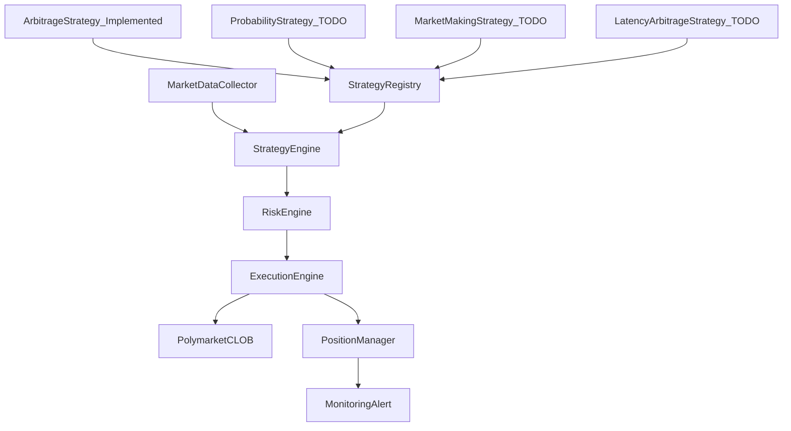

# Polymarket Rust 多策略交易系统 — 技术架构文档

## 1. 背景与设计原则

本系统基于 [plan.md](../plan.md) 中的生产级 Polymarket 自动交易架构，使用 **Rust** 实现，面向套利、做市与 AI 预测交易等场景。当前版本**仅实现套利策略**（`YES_price + NO_price < 1`），其余策略以扩展点形式预留，状态为 **TODO**。

设计原则：

- **低延迟**：WebSocket 直连 CLOB，避免 REST 轮询；关键路径无阻塞。
- **可扩展**：多策略通过 trait 抽象与注册机制接入，便于新增策略而不改核心引擎。
- **可观测**：统一指标、日志与告警，便于生产运维。
- **风控优先**：仓位、单笔、日损等硬约束在信号到执行全链路生效。

---

## 2. 系统分层架构

系统采用与 plan 一致的 5 层核心结构；在工程实现中将状态管理与可观测性拆为独立模块，便于维护与扩展。对应关系如下：



| 层级 | 模块 | 职责（Rust 语境） |
| ---- | ---- | ----------------- |
| 数据层 | Market Data Collector / Orderbook Engine | 订阅 orderbook、维护本地簿、产出 best_bid/best_ask 等快照 |
| 策略层 | Strategy Engine | 多策略注册与调度，根据行情生成交易信号 |
| 风控层 | Risk Engine | 仓位/单笔/日损校验，熔断与停止交易 |
| 执行层 | Execution Engine | 下单、撤单、部分成交处理，与 Polymarket CLOB 交互 |
| 状态层 | Position Manager | 维护 positions、PnL、exposure |
| 观测层 | Monitoring & Alert | 指标、日志、告警与健康检查 |

数据流：**行情 → 策略信号 → 风控校验 → 下单 → 成交回报 → 持仓更新 → 监控**。

---

## 3. Rust 项目结构建议

推荐按 crate 划分职责，便于测试与演进：

```text
poly2/
├── Cargo.toml                 # workspace
├── crates/
│   ├── market_data/            # 行情与 orderbook
│   ├── strategy/               # 策略 trait 与各策略实现
│   ├── risk/                   # 风控规则
│   ├── execution/              # 下单与交易所交互
│   ├── position/               # 持仓与 PnL
│   ├── config/                 # 配置与 env
│   └── trading_core/           # 主流程编排、注册表、错误类型
├── docs/
│   └── rust-trading-architecture.md
└── plan.md
```

- **配置与错误**：统一 `config` 加载（YAML/ENV），统一 `thiserror`/`anyhow` 错误类型，便于日志与重试。
- **抽象**：策略层仅依赖 `MarketSnapshot`、`OrderRequest`、`RiskContext` 等接口，不依赖具体交易所实现，便于单测与替换。

---

## 4. 多策略框架设计

### 4.1 策略状态说明

| 策略 | 状态 | 说明 |
| ---- | ---- | ---- |
| 套利（YES_price + NO_price < 1） | **已实现** | 当前唯一落地策略 |
| 事件概率交易 | TODO | LLM/外部概率 vs 市场价格 |
| 做市 | TODO | mid ± spread 挂单 |
| 延迟套利 | TODO | 事件/新闻快于市场定价 |

### 4.2 Strategy trait（接口定义）

所有策略均实现同一 trait，便于注册与调度：

```rust
/// 策略唯一标识
#[derive(Clone, Debug, Hash, Eq, PartialEq)]
pub enum StrategyId {
    Arbitrage,
    ProbabilityTrading,  // TODO
    MarketMaking,        // TODO
    LatencyArbitrage,    // TODO
}

/// 策略状态，用于注册表与启停
#[derive(Clone, Debug)]
pub enum StrategyStatus {
    Implemented,
    Todo,  // 占位，不参与调度
}

/// 策略输出：是否产生信号及具体订单意图
#[derive(Clone, Debug)]
pub struct StrategySignal {
    pub strategy_id: StrategyId,
    pub market_id: String,
    pub actions: Vec<OrderIntent>,  // 如 BuyYes, BuyNo
}

#[derive(Clone, Debug)]
pub struct OrderIntent {
    pub side: Side,       // Yes / No
    pub price: Decimal,
    pub size: Decimal,
}

/// 多策略统一接口
#[async_trait]
pub trait Strategy: Send + Sync {
    fn id(&self) -> StrategyId;
    fn status(&self) -> StrategyStatus;

    /// 根据当前行情与可选上下文生成信号；TODO 策略应返回 Ok(None)
    async fn generate_signal(
        &self,
        snapshot: &MarketSnapshot,
        context: &StrategyContext,
    ) -> Result<Option<StrategySignal>, StrategyError>;

    /// 参数校验（如最小利润、最大仓位）
    fn validate_params(&self) -> Result<(), ConfigError>;
}
```

### 4.3 StrategyRegistry（注册与调度）

- 启动时向 `StrategyRegistry` 注册所有策略（含 TODO 占位）。
- 引擎只对 `status == Implemented` 的策略调用 `generate_signal`。
- 调度方式：按市场/定时驱动，将 `MarketSnapshot` 注入各已实现策略，汇总 `StrategySignal` 后进入风控与执行。

```rust
pub struct StrategyRegistry {
    strategies: HashMap<StrategyId, Box<dyn Strategy>>,
}

impl StrategyRegistry {
    pub async fn active_signals(
        &self,
        snapshot: &MarketSnapshot,
        ctx: &StrategyContext,
    ) -> Vec<StrategySignal> {
        use futures::stream::{FuturesUnordered, StreamExt};

        let mut futures = self
            .strategies
            .values()
            .filter(|s| matches!(s.status(), StrategyStatus::Implemented))
            .map(|s| s.generate_signal(snapshot, ctx))
            .collect::<FuturesUnordered<_>>();

        let mut out = Vec::new();
        while let Some(result) = futures.next().await {
            if let Ok(Some(signal)) = result {
                out.push(signal);
            }
        }
        out
    }
}
```

---

## 5. 当前已实现策略：套利策略

**重要**：当前版本仅实现本策略，其余策略均为 TODO。

### 5.1 触发条件

当同一市场的 YES 与 NO 买价满足：

```text
YES_ask + NO_ask + total_cost_buffer < 1
```

时，视为存在套利空间。执行动作为：**买入 YES** 与 **买入 NO**，到期时两者之和至少为 1；在计入手续费、滑点与未完全成交风险后，目标是获得正期望收益而非无条件锁定利润。

### 5.2 执行链路

1. **行情**：Market Data 提供该市场的 best_ask(YES)、best_ask(NO)（或 mid）。
2. **机会识别**：套利策略计算 `effective_sum = YES_ask + NO_ask + total_cost_buffer`，若 `effective_sum < 1 - min_profit_threshold` 则生成信号。
3. **风控校验**：Risk Engine 校验仓位上限、单笔上限、日损限制等，不通过则丢弃信号。
4. **下单**：Execution Engine 向 Polymarket CLOB 发送 buy YES、buy NO 订单（可带滑点缓冲）。
5. **成交回报**：处理部分成交与失败重试。
6. **持仓更新**：Position Manager 更新 positions / PnL / exposure。

### 5.3 参数建议

| 参数 | 说明 | 示例 |
| ---- | ---- | ---- |
| `min_profit_threshold` | 最小利润阈值（1 - sum 的下界） | 0.005 |
| `slippage_bps` | 滑点缓冲（基点） | 5–10 |
| `min_liquidity` | 最小挂单深度，避免冲击成本 | 按 size 校验 |
| `max_single_trade_pct` | 单笔占资金比例上限 | 0.5% |

上述参数应在配置中可调，并在 `validate_params()` 中做合法性检查。

---

## 6. 风控与执行约束

与 plan 保持一致，生产必须落地的规则示例：

| 规则 | 说明 | 触发动作 |
| ---- | ---- | -------- |
| 最大仓位 | 单市场/总仓位 ≤ 2% 资金 | 拒绝新开仓 |
| 最大单笔 | 单笔 ≤ 0.5% 资金 | 拒绝或裁剪订单 |
| 日损限制 | 当日亏损 ≥ 5% 资金 | 停止交易（熔断） |

执行流程：

```text
strategy signal → risk check → create order → send to exchange → monitor fill
```

- 失败与超时应有重试策略（次数/退避可配置），并上报监控。
- 风控模块对外提供 `RiskContext`（当前仓位、今日 PnL、资金），供策略与执行层只读使用。

---

## 7. 可观测性与运维

- **指标**：PnL、延迟（信号到下单、下单到成交）、订单失败率、API 错误率、各策略信号次数。
- **日志**：结构化日志（请求 id、market_id、strategy_id、订单 id），便于排查。
- **告警**：日损熔断、API 连续失败、延迟超过阈值时告警。
- **健康检查**：WebSocket 连接状态、Redis/依赖可用性，供部署层探活。

推荐技术栈与 plan 一致：Prometheus + Grafana；日志可对接现有 ELK 或等价方案。

---

## 8. TODO 策略扩展

以下策略仅定义扩展点与未来实现方向，**当前不参与调度**。

### 8.1 事件概率交易（TODO）

- **思路**：外部概率（如 LLM 预测）与市场价格偏离时下单，例如 LLM 概率 0.63、市场 0.54 时买入 YES。
- **扩展点**：策略需接入“概率源”接口（如 gRPC/HTTP），在 `StrategyContext` 中提供 `external_probability`；`generate_signal` 内比较市场价与外部概率并生成订单意图。

### 8.2 做市策略（TODO）

- **思路**：mid = (best_bid + best_ask) / 2，挂单 bid = mid - spread，ask = mid + spread，赚取 spread。
- **扩展点**：需要订单簿深度与更新频率，策略输出为挂单/撤单意图，执行层需支持 maker 订单与库存管理。

### 8.3 延迟套利（TODO）

- **思路**：监听 BTC/ETH/CPI/选举等事件或新闻，在事件概率变化快于市场时抢先下单。
- **扩展点**：需事件流或新闻信号接入，与市场数据在时间上对齐，策略输出为方向与规模，执行层需低延迟。

---

## 9. 附录

### 9.1 关键数据结构草案（Rust 伪代码）

```rust
// 行情快照（由 Market Data / Orderbook 提供）
pub struct MarketSnapshot {
    pub market_id: String,
    pub yes_best_bid: Decimal,
    pub yes_best_ask: Decimal,
    pub no_best_bid: Decimal,
    pub no_best_ask: Decimal,
    pub volume_24h: Option<Decimal>,
    pub timestamp: DateTime<Utc>,
}

// 风控上下文（只读）
pub struct RiskContext {
    pub total_capital: Decimal,
    pub position_per_market: HashMap<String, Position>,
    pub daily_pnl: Decimal,
    pub config: RiskConfig,
}

// 策略上下文（可扩展，如接入概率源）
pub struct StrategyContext {
    pub risk: RiskContext,
    pub external_probability: Option<Decimal>,  // TODO: 概率策略
}
```

### 9.2 配置样例（YAML/ENV 字段定义）

```yaml
# 策略开关与参数
strategies:
  arbitrage:
    enabled: true
    min_profit_threshold: 0.005
    slippage_bps: 10
    min_liquidity: 100
  probability_trading:
    enabled: false   # TODO
  market_making:
    enabled: false   # TODO
  latency_arbitrage:
    enabled: false   # TODO

# 风控
risk:
  max_position_pct: 0.02
  max_single_trade_pct: 0.005
  daily_loss_limit_pct: 0.05

# 执行
execution:
  polymarket_ws_url: "wss://..."
  max_retries: 3
  timeout_secs: 10
```

---

## 10. 验收标准（与计划对齐）

- [x] 文档明确写出**当前仅实现套利策略**，并给出可执行的触发公式（`YES_price + NO_price < 1`）与执行流程。
- [x] 多策略扩展方式可落地：Strategy trait + Registry + 状态标注（Implemented/TODO）。
- [x] 各模块职责清晰，可直接指导后续 Rust 工程实现。
- [x] TODO 策略边界清楚，不与当前套利实现混淆。
